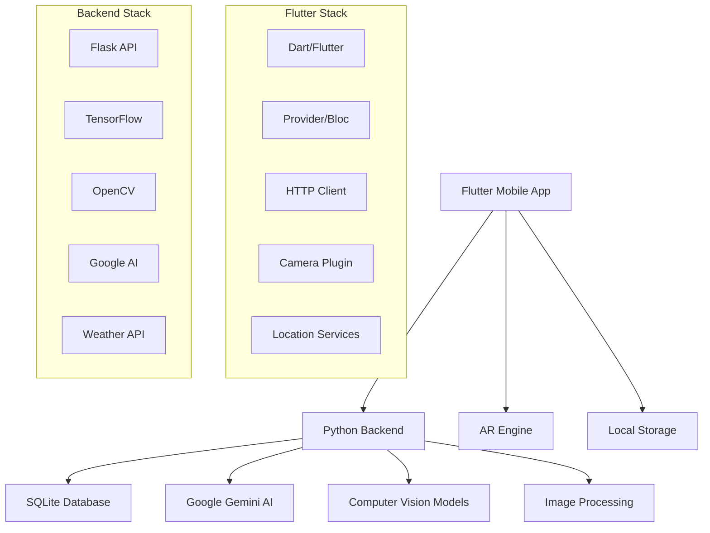

# 🏺 KemetPass - Egyptian Heritage Experience

<div align="center">


<!-- Animated badges -->
[](https://git.io/typing-svg)

[](https://flutter.dev)
[](https://dart.dev)
[](https://python.org)
[](https://flask.palletsprojects.com)


</div>

## 🌟 Overview

KemetPass is a revolutionary **Flutter mobile application** that brings ancient Egyptian heritage to life through modern technology. Experience Egypt's rich cultural history through AR experiences, AI-powered features, hieroglyphic translation, and immersive historical site exploration - all in the palm of your hand.

<details open>
<summary><h2>🎯 Key Features</h2></summary>

### 📱 Mobile-First Experience
- **Cross-Platform**: Native performance on iOS and Android
- **Responsive Design**: Seamless experience across all devices
- **Offline Support**: Access key features without internet

### 🔮 AR Experience
- **Augmented Reality**: Bring historical sites to life
- **3D Models**: Interactive ancient Egyptian artifacts
- **Virtual Tours**: Explore pyramids and temples from anywhere

### 🔤 Hieroglyphic Translator
- **AI-Powered Translation**: Convert hieroglyphics to modern text
- **Camera Integration**: Point and translate in real-time
- **Machine Learning**: Advanced Egyptian symbol recognition

### 🤖 Intelligent Chatbot
- **Cultural Assistant**: AI-powered Egyptian history expert
- **Multi-language Support**: Arabic and English interface
- **Voice Integration**: Talk to ancient pharaohs

### 📍 Smart Location Services
- **Where Am I**: GPS-based historical site identification
- **Who Am I**: Image recognition for artifacts and figures
- **Know Me**: Personalized cultural recommendations

### 🌤️ Weather Integration
- **Real-time Weather**: Current conditions for Egyptian cities
- **Travel Planning**: Weather-based tourism recommendations
- **Historical Climate**: Ancient vs. modern weather data

### 🗺️ Trip Planner
- **Smart Itineraries**: AI-generated travel plans
- **Historical Routes**: Follow ancient trade paths
- **Cultural Events**: Local festivals and celebrations

### 👥 Community Features
- **Social Sharing**: Share discoveries with fellow explorers
- **Leaderboards**: Compete in cultural knowledge quizzes
- **Bookmarks**: Save favorite sites and artifacts

</details>

## 🚀 Quick Start

<details>
<summary><h3>📋 Prerequisites</h3></summary>

- **Flutter SDK** 3.0+
- **Dart** 3.0+
- **Android Studio** / **Xcode**
- **Python** 3.9+ (for backend)
- **Git**

</details>

### 🛠️ Installation

```bash
# Clone the repository
git clone https://github.com/mohamedgobaraa/KemetPass-mobile-app.git
cd kemetpass

# Get Flutter dependencies
flutter pub get

# Setup backend
cd lib/python-backend
pip install -r requirements.txt

# Run the backend
python app.py
```

### 🏃‍♂️ Running the Application

<details>
<summary><b>📱 Flutter App</b></summary>

```bash
# Check Flutter installation
flutter doctor

# Run on Android
flutter run

# Run on iOS
flutter run -d ios

# Build for release
flutter build apk --release
flutter build ios --release
```

</details>

<details>
<summary><b>🔧 Backend Services</b></summary>

```bash
cd lib/python-backend

# Start Flask development server
python app.py

# API will be available at: http://localhost:5000
```

</details>

## 🏗️ Architecture



## 📁 Project Structure

```
kemetpass/
├── 📱 lib/                      # Flutter source code
│   ├── core/                    # Core functionality
│   │   ├── navigation/          # App navigation
│   │   ├── theme/              # App theming
│   │   └── widgets/            # Reusable widgets
│   ├── screens/                # App screens
│   │   ├── home_screen.dart
│   │   ├── ar_experience.dart
│   │   ├── translator_screen.dart
│   │   └── ...
│   ├── services/               # API & local services
│   │   ├── api_service.dart
│   │   └── database_service.dart
│   ├── widgets/                # Custom widgets
│   ├── python-backend/         # Flask backend
│   │   ├── app.py
│   │   ├── database.py
│   │   └── models/
│   └── main.dart              # App entry point
├── 🤖 android/                 # Android configuration
├── 🍎 ios/                     # iOS configuration
├── 🐧 linux/                   # Linux configuration
├── 🪟 windows/                 # Windows configuration
├── 🌐 web/                     # Web configuration
├── 📦 pubspec.yaml            # Flutter dependencies
└── 🐍 requirements.txt        # Python dependencies
```

## 🎯 API Integration

<details>
<summary><h3>🔐 Authentication</h3></summary>

| Endpoint | Method | Description |
|----------|--------|-------------|
| `/auth/register` | `POST` | User registration |
| `/auth/login` | `POST` | User login |
| `/auth/profile` | `GET` | Get user profile |

</details>

<details>
<summary><h3>🔤 Core Features</h3></summary>

| Endpoint | Method | Description |
|----------|--------|-------------|
| `/translate` | `POST` | Hieroglyphic translation |
| `/where-am-i` | `POST` | Location identification |
| `/who-am-i` | `POST` | Image recognition |
| `/chatbot` | `POST` | AI assistant |
| `/weather` | `GET` | Weather data |

</details>

## 🛡️ Technologies Used

<div align="center">

### Mobile Development
[](https://flutter.dev)
[](https://dart.dev)
[](https://android.com)
[](https://developer.apple.com/ios)

### Backend & AI
[](https://python.org)
[](https://flask.palletsprojects.com)
[](https://tensorflow.org)
[](https://sqlite.org)

### AI & ML
[](https://ai.google)
[](https://opencv.org)

</div>

## 🤝 Contributing

We welcome contributions to KemetPass! Here's how you can help:

<details>
<summary><h3>🔧 Development Setup</h3></summary>

1. **Fork** the repository
2. **Clone** your fork
3. **Create** a feature branch
4. **Make** your changes
5. **Test** thoroughly
6. **Submit** a pull request

```bash
git checkout -b feature/amazing-feature
git commit -m 'Add amazing feature'
git push origin feature/amazing-feature
```

</details>

<details>
<summary><h3>📋 Contribution Guidelines</h3></summary>

- Follow Flutter/Dart style guidelines
- Write meaningful commit messages
- Add tests for new features
- Update documentation
- Ensure all tests pass
- Follow semantic versioning

</details>

## 📄 License

This project is licensed under the **MIT License** - see the [LICENSE](LICENSE) file for details.

## 🏆 Acknowledgments

- **Ancient Egyptian Heritage** - For inspiring this project
- **Flutter Team** - For the amazing framework
- **Google AI** - For Gemini API integration
- **Open Source Community** - For incredible packages and tools
- **Egyptian Ministry of Tourism** - For cultural guidance

---

<div align="center">

### 📞 Contact & Support

[](mailto:eng.mohamed.gobara@gmail.com)
[](https://github.com/mohamedgobaraa/KemetPass-mobile-app)
[](https://github.com/mohamedgobaraa/KemetPass-mobile-app#readme)

**Made with ❤️ for Egyptian Cultural Heritage**


</div>

<!-- Animated footer -->
<div align="center">
  
</div>
